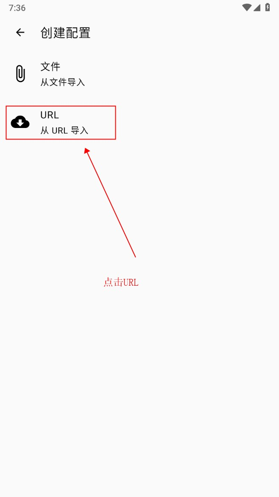

[toc]
# Basic
## How to step over the Great Wall at Android?    
### 1. Download the app[^1]
https://github.com/Kr328/ClashForAndroid/releases/download/v2.5.12/cfa-2.5.12-foss-arm64-v8a-release.apk

### 2. Install the app
### 3. 点击“配置”

### 4. 点击右上角“＋”

### 5. 点击“URL”导入

### 6. 如下图做①②③④操作
第②步用到的URL为[^1] https://sub1.small3strawberry.com/a3pi/v1/clien3t/subscribe?token=123

### 7. 如下图做①②操作

### 8. 如下图做①②操作

### 9. 如下图看到高亮“运行中”，证明成功了

此时可以去浏览器输入 www.google.com 测试一下

## How to stop？
### 1. 点击"运行中"，变灰它

# Advanced
## How to keep high speed?    
### 1. 点击“代理”

### 2. 如下图做①②操作

### 3. 如下图选择"规则模式"
这样以后只有国外网站需要代理，节省了大量高速流量，把高速流量用在刀刃上

## How to avoid: Website was connected but is empty?
### 1. Download Chrome browser

# Footnotes
[^1]:https://一元机场.com
